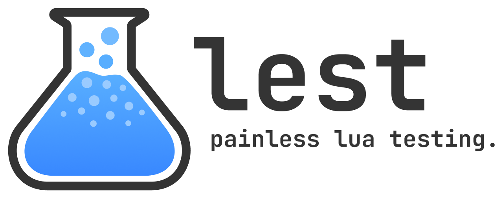

<h1 align="center">
	
</h1>
<p align="center">
	<a href="https://www.npmjs.com/package/@taservers/lest" style="text-decoration: none;">
		
	</a>
	<a href="https://github.com/TAServers/lest/actions/workflows/release.yml" style="text-decoration: none;">
		
	</a>
	<a href="https://discord.taservers.com" style="text-decoration: none;">
		
	</a>
	<a href="https://github.com/TAServers/lest/blob/master/LICENSE">
		
	</a>
</p>

---

Lest is an easy to use and performant Lua testing framework sporting an API that aligns with Jest. If you've tested JavaScript or TypeScirpt before you probably already know how to use it!

Lest can be run with zero dependencies by downloading the `lest.lua` file published with every GitHub release, or you can install the [`@taservers/lest` NPM Package][npm-package] which is recommended for easy updating and version management.

## Key Features

-   API that 1:1 matches Jest in most places (with some Lua-specific aliases like `toBeNil`)
-   Fast test running despite being a single thread, with Lest's 157 tests (at the time of writing) running in **under a second**!
-   Full support for all major versions of Lua (`5.1.5`, `5.2.4`, `5.3.6`, `5.4.4`, `LuaJIT 2.0.5` and `LuaJIT 2.1.0`)

## Quick Links

-   [API Documentation][api-docs]
-   [`@taservers/lest` NPM Package][npm-package]
-   [Discord Server][discord]
    -   ⚠️ Unlike our GitHub, the TAS Discord server is not moderated beyond ToS and NSFW

## Getting Started

Install Lest using your package manager of choice (this guide assumes NPM):

```
npm install --save-dev @taservers/lest
```

Next, create a simple function to test in `sum.lua`:

```lua
-- sum.lua
local function sum(a, b)
  return a + b
end

return sum
```

Then, create a new test file with the `.test.lua` suffix (this is what Lest looks for by default):

```lua
-- sum.test.lua
local sum = require("sum")

test("adds 1 + 2 to equal 3", function()
  expect(sum(1, 2)).toBe(3)
end)
```

Finally, run your tests with `npx lest`!

## Configuration

Most configuration options can be either passed in from the CLI or defined in a Lua config file, but there are a couple of special CLI-only options:

-   `--config` tells Lest where to read the config file from (default: `lest.config.lua`)
-   `--luaCommand` is unique to the `@taservers/lest` NPM package and determines what command to run when executing Lua. If not specified, Lest will try to find an installed Lua binary automatically using the order defined [here][lua-command-priority]

The Lest config file should be a valid Lua script returning a table containing config options. For example:

```lua
-- lest.config.lua
return {
  testMatch = { "tests/lua/.+%.test%.lua" }
}
```

As this script is executed before running or scanning for tests, you can use it to perform setup actions like defining `package.path`. A dedicated `setupFile` option will also be added in the future.

For a full list of configuration options, see the docs page here (🚧 UNDER CONSTRUCTION 🚧).

[npm-package]: https://www.npmjs.com/package/@taservers/lest
[api-docs]: https://taservers.github.io/lest/docs/api/expect
[discord]: https://discord.taservers.com
[lua-command-priority]: https://github.com/TAServers/lest/blob/master/packages/lest/src/helpers/lua-executable-names.json
